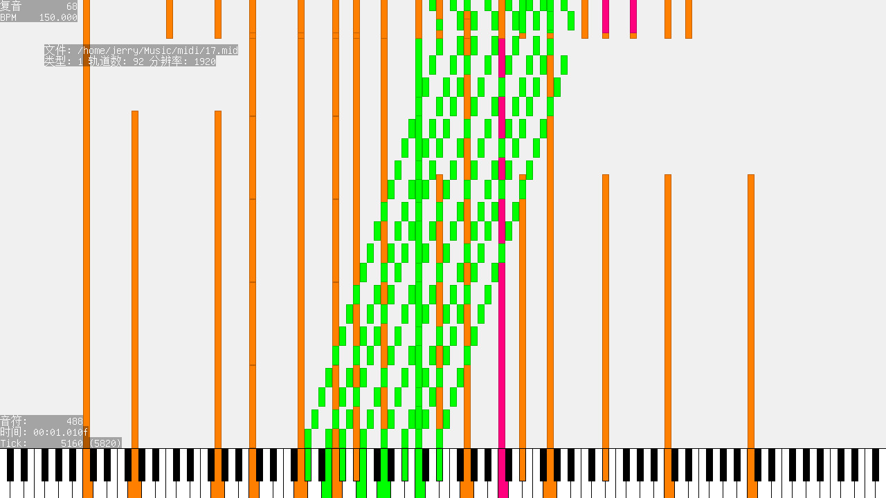

# midi-rawvideo

## Dependency

bass, bassmidi, bass_fx, bassenc

put .h in include-bass and .so in lib64-bass

## Build

run build.sh

## Usage

modify soundfont list in main.c and recompile

use run.sh or set LD_LIBRARY_PATH to lib64-bass by yourself

## Screenshot

